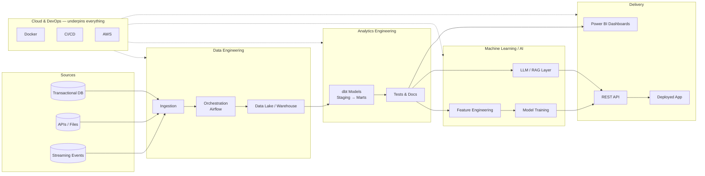
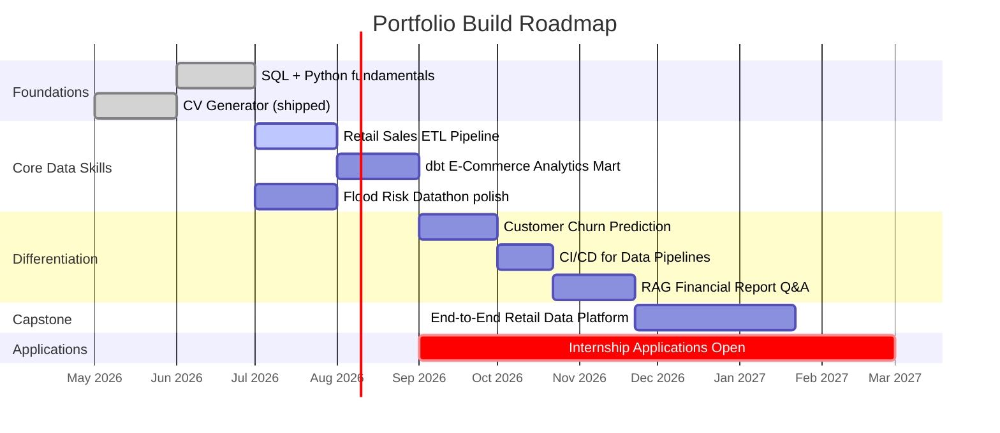

<div align="center">

# Lionael Surya

### Data Engineer · Analytics Engineer · ML/AI Engineer in training

**Data Science Student @ Seneca Polytechnic, Canada**
Building production-style data systems — from raw pipelines to deployed ML/AI products.

[](mailto:suryalionael@gmail.com)
[](#)
[](#)
[](#)


</div>

---

## About This Repository

This repository is the **central hub** for my data and software engineering portfolio. Instead of scattering unrelated projects, every project here is organized by **discipline** and tells a story about a **real business problem**, built the way it would be built on a real data team: versioned, documented, tested, and reproducible.

> No toy datasets dressed up as "projects." Every repo below simulates a real stakeholder, a real decision, and a real system someone could run.

---

## Career Objective

I'm a Data Science student at Seneca Polytechnic (Canada) building toward a full-stack data career: comfortable moving data through a pipeline, modeling it into something a business can trust, training a model on top of it, and shipping all of it as something a non-technical stakeholder can actually use. My goal is a **Data Analyst, Data Engineer, Analytics Engineer, or Data Science internship/co-op** where I can apply production data engineering and analytics skills to real organizational problems, then grow into a full-time Data/ML/AI Engineering role.

## Internship Target Roles

| Role | Why I'm a Fit |
|---|---|
| **Data Analyst (Co-op)** | SQL-first thinking, Power BI dashboards, stakeholder-ready insights — see [`case-studies/`](case-studies/) |
| **Data Engineer (Intern)** | ETL/ELT pipelines, orchestration, data quality — see [`data-engineering/`](data-engineering/) |
| **Analytics Engineer (Intern)** | dbt modeling, dimensional design, semantic layers — see [`analytics-engineering/`](analytics-engineering/) |
| **Data Science Intern** | Feature engineering, model evaluation, explainability — see [`machine-learning/`](machine-learning/) |
| **AI/ML Engineer (Intern)** | LLM apps, RAG, agent tooling — see [`ai-engineering/`](ai-engineering/) |
| **Junior Software Developer** | Shipped, working products — see [`software-products/`](software-products/) |

---

## Repository Navigation

```
Lionael-Surya/
│
├── data-engineering/         ETL/ELT pipelines, orchestration, data warehousing
├── analytics-engineering/    dbt models, dimensional design, semantic/BI layer
├── machine-learning/         Predictive modeling, forecasting, explainability
├── ai-engineering/           LLM apps, RAG systems, AI agents
├── software-products/        Shipped, end-user-facing applications
├── cloud-devops/             CI/CD, IaC, serverless, cloud deployment
└── case-studies/             Cross-discipline, stakeholder-facing analyses
```

| Folder | What lives here | Core tools |
|---|---|---|
| [`data-engineering/`](data-engineering/) | Batch & streaming pipelines, data warehousing | Python, SQL, Airflow, Spark, Kafka, Docker |
| [`analytics-engineering/`](analytics-engineering/) | dbt transformation layers, dimensional models | dbt, SQL, Snowflake/BigQuery, Power BI |
| [`machine-learning/`](machine-learning/) | Supervised learning, forecasting, deployment | Python, scikit-learn, XGBoost, SHAP, FastAPI |
| [`ai-engineering/`](ai-engineering/) | RAG pipelines, LLM orchestration, AI agents | LangChain, OpenAI/Claude API, vector DBs |
| [`software-products/`](software-products/) | Complete, usable applications | Google Apps Script, JavaScript, Python |
| [`cloud-devops/`](cloud-devops/) | CI/CD, infrastructure as code, serverless | GitHub Actions, Terraform, AWS |
| [`case-studies/`](case-studies/) | End-to-end, narrative-driven business analyses | All of the above, combined |

---

## Skills Matrix

| Domain | Skills | Proficiency |
|---|---|---|
| **Programming** | Python, SQL, JavaScript (Apps Script) | ●●●●○ |
| **Data Engineering** | ETL/ELT design, Airflow, Kafka, Spark, data quality testing | ●●●○○ |
| **Analytics Engineering** | dbt, dimensional modeling (star/snowflake), semantic layers | ●●●○○ |
| **Data Warehousing** | PostgreSQL, Snowflake, BigQuery, schema design | ●●●○○ |
| **BI & Visualization** | Power BI, DAX, dashboard storytelling | ●●●●○ |
| **Machine Learning** | scikit-learn, XGBoost, model evaluation, SHAP explainability | ●●●○○ |
| **AI Engineering** | LangChain, RAG, embeddings, vector DBs, prompt/agent design | ●●●○○ |
| **Cloud & DevOps** | AWS (S3, Lambda, Glue), Docker, GitHub Actions, Terraform basics | ●●○○○ |
| **Software Development** | API development (FastAPI/Flask), automation scripting, version control | ●●●○○ |

*Proficiency reflects current skill level and is updated as projects ship — see the [12-month roadmap](#12-month-portfolio-growth-strategy) below.*

---

## Featured Projects

| Project | Category | Business Problem | Status |
|---|---|---|---|
| 🏆 [End-to-End Retail Data Platform](case-studies/end-to-end-retail-data-platform/) | Case Study | Capstone: raw data → warehouse → ML → BI in one platform | 🔜 Planned |
| 🌊 [Flood Risk Prediction — Dicoding Datathon 2026](case-studies/flood-risk-datathon-2026/) | Case Study | Predicting flood risk from environmental data for disaster preparedness | ✅ In Progress |
| 📦 [Retail Sales ETL Pipeline](data-engineering/retail-sales-etl-pipeline/) | Data Engineering | Automating multi-store sales ingestion into a warehouse | 🔜 Planned |
| 📊 [dbt E-Commerce Analytics Mart](analytics-engineering/dbt-ecommerce-analytics-mart/) | Analytics Engineering | Turning raw order data into trusted, tested business metrics | 🔜 Planned |
| 📉 [Customer Churn Prediction](machine-learning/customer-churn-prediction-telecom/) | Machine Learning | Predicting telecom churn to target retention spend | 🔜 Planned |
| 🤖 [RAG Financial Report Q&A](ai-engineering/rag-financial-report-qa/) | AI Engineering | LLM-powered Q&A over financial filings | 🔜 Planned |
| 📄 [CV Generator (GAS)](software-products/cv-generator-gas/) | Software Product | Automated CV generation for HR at PT Magna Solusi Indonesia | ✅ Shipped |
| 📈 [Stock Signal Scanner](https://github.com/suryalionael) *(separate repo: `AI Saham Pro`)* | Machine Learning | Rule/signal-based stock screening with `yfinance` | 🚧 In Progress |

---

## Architecture Overview

How the disciplines in this portfolio connect — the same flow a real data team follows from raw source to business decision:



---

## Recommended Project Order (Recruiter Impact)

Built and reviewed in this order — each project is designed to be demoable on its own within 2–3 minutes:

1. **[CV Generator (GAS)](software-products/cv-generator-gas/)** — already shipped; proves I can ship a real, used tool end-to-end.
2. **[Flood Risk Datathon Case Study](case-studies/flood-risk-datathon-2026/)** — proves I can work with real, messy data under competition constraints.
3. **[Retail Sales ETL Pipeline](data-engineering/retail-sales-etl-pipeline/)** — the highest-signal project for Data Engineer/Analyst roles; demonstrates pipeline thinking.
4. **[dbt E-Commerce Analytics Mart](analytics-engineering/dbt-ecommerce-analytics-mart/)** — strongest single project for Analytics Engineer roles; dbt is the #1 requested skill in that title.
5. **[Customer Churn Prediction](machine-learning/customer-churn-prediction-telecom/)** — classic, well-understood business ML problem recruiters can evaluate quickly.
6. **[CI/CD for Data Pipelines](cloud-devops/cicd-data-pipeline-deployment/)** — signals engineering maturity beyond notebooks.
7. **[RAG Financial Report Q&A](ai-engineering/rag-financial-report-qa/)** — differentiator; most student portfolios don't have a working LLM system.
8. **[End-to-End Retail Data Platform](case-studies/end-to-end-retail-data-platform/)** — capstone; ties every discipline above into one platform, built last on purpose.

**Why this order:** Analyst/Data Engineer/Analytics Engineer roles get the most co-op postings, so projects 1–4 maximize the number of roles I can credibly apply to early. ML and AI projects (5, 7) differentiate me from other applicants. The capstone (8) is saved for last because it's only convincing once the individual pieces already exist.

---

## Recommended Technologies by Project

| Project | Primary Stack |
|---|---|
| Retail Sales ETL Pipeline | Python, Pandas, PostgreSQL, Apache Airflow, Docker, Great Expectations |
| Streaming Clickstream Pipeline | Apache Kafka, Spark Structured Streaming, AWS S3, Python |
| dbt E-Commerce Analytics Mart | dbt-core, Snowflake/BigQuery/PostgreSQL, SQL, Power BI, GitHub Actions |
| SaaS Subscription Metrics Model | dbt, SQL, Power BI, cohort-analysis SQL patterns |
| Customer Churn Prediction | Python, scikit-learn, XGBoost, SHAP, FastAPI, Streamlit, Docker |
| Retail Demand Forecasting | Python, Prophet, XGBoost, pandas, backtesting framework |
| RAG Financial Report Q&A | Python, LangChain, OpenAI/Claude API, ChromaDB, FastAPI, Streamlit |
| AI Customer Support Agent | LangChain/LlamaIndex, Claude/OpenAI API, FastAPI, tool-calling |
| CV Generator (GAS) | Google Apps Script, Google Docs/Sheets API, JavaScript |
| Expense Tracker Automation | Google Apps Script, Google Sheets API, JavaScript |
| CI/CD for Data Pipelines | GitHub Actions, Docker, AWS ECR/ECS, Terraform |
| Serverless ETL (AWS Lambda) | AWS Lambda, S3, Glue, Athena, boto3 |
| Flood Risk Datathon | Python, pandas, scikit-learn, geospatial libraries, matplotlib/seaborn |
| End-to-End Retail Data Platform | Full stack above, integrated |

---

## Portfolio Roadmap: Beginner → Internship-Ready



| Phase | Timeframe | Focus | Outcome |
|---|---|---|---|
| **1. Foundations** | Done → Month 1 | SQL/Python fluency, first shipped product | Credible GitHub profile exists |
| **2. Core Data Skills** | Months 1–3 | ETL pipeline + dbt mart + datathon writeup | Can apply to Data Analyst / DE internships |
| **3. Differentiation** | Months 3–6 | ML model + CI/CD + RAG system | Stands out vs. typical bootcamp portfolios |
| **4. Capstone** | Months 6–8 | Integrated end-to-end platform | Flagship project for top-tier interviews |
| **5. Applications** | Month 3 onward | Apply continuously while iterating | Internship/co-op offers |

---

## Future Project Ideas

- **Data Engineering:** Change Data Capture (CDC) pipeline with Debezium + Kafka; dbt + Airflow orchestrated lakehouse on Databricks.
- **Analytics Engineering:** Marketing attribution model in dbt; semantic layer with dbt Metrics/MetricFlow.
- **Machine Learning:** Fraud detection with imbalanced-class techniques; A/B test analysis & causal inference case study.
- **AI Engineering:** Multi-agent research assistant with tool use; fine-tuned small model for domain-specific classification.
- **Cloud/DevOps:** Multi-environment Terraform setup (dev/staging/prod) for a data platform; Kubernetes-based pipeline orchestration.
- **Case Studies:** Indonesian SME digitalization case study (bridging personal bookkeeping work into a formal data project); public transit ridership analysis for a Canadian city.

---

## Contribution Guidelines

This is a personal portfolio, but it's built like a real engineering repo:

- Each project folder is **self-contained** with its own `README.md`, setup instructions, and (where applicable) `requirements.txt`/environment file.
- Commits follow [Conventional Commits](https://www.conventionalcommits.org/) (`feat:`, `fix:`, `docs:`, `chore:`).
- Suggestions, code review feedback, or issue reports are welcome via GitHub Issues — see [`CONTRIBUTING.md`](CONTRIBUTING.md).
- No project is merged into `main` without a working README and a reproducible setup step.

---

## 12-Month Portfolio Growth Strategy

| Quarter | Goal | Deliverables |
|---|---|---|
| **Q1** (Months 1–3) | Establish core data engineering & analytics engineering credibility | Retail ETL pipeline, dbt mart, polished datathon case study |
| **Q2** (Months 4–6) | Add ML + cloud/DevOps maturity | Churn prediction model + deployment, CI/CD pipeline, AWS serverless ETL |
| **Q3** (Months 7–9) | Differentiate with AI engineering, start applying | RAG system, AI support agent, begin internship applications |
| **Q4** (Months 10–12) | Ship capstone, convert applications to interviews | End-to-end retail data platform, refresh README with metrics/results from real interviews and feedback |

**Operating principle:** ship something small every 2–3 weeks rather than one big project every 6 months. Each project README is updated with real screenshots/dashboards/metrics as soon as it's functional — this file is reviewed and refreshed monthly.

---

<div align="center">

*Last updated: June 2026 — this README evolves as projects ship. Star ⭐ this repo to follow progress.*

</div>
