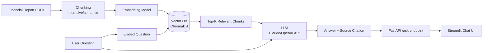

# RAG Financial Report Q&A

**Status:** 🔜 Planned

## Business Problem

Analysts spend hours manually searching through long annual reports / 10-K filings to answer specific questions ("What was R&D spend in 2023 vs 2022?"). They need a tool that answers questions grounded in the actual filing text — with citations — instead of an LLM hallucinating a plausible-sounding number.

## Objective

Build a Retrieval-Augmented Generation system that ingests financial report PDFs, retrieves the most relevant passages for a given question, and generates an answer that cites the source section — with a measured retrieval accuracy, not just a vibe check.

## Architecture

## Planned Tech Stack

- **Orchestration:** LangChain
- **LLM:** Claude API or OpenAI API (configurable)
- **Vector DB:** ChromaDB (local, no infra dependency)
- **Embeddings:** OpenAI `text-embedding-3-small` or open-source `sentence-transformers`
- **Backend:** FastAPI
- **UI:** Streamlit chat interface
- **Evaluation:** A small hand-labeled Q&A set with retrieval-precision and answer-faithfulness scoring

## Planned Deliverables

- [ ] PDF ingestion + chunking pipeline
- [ ] Vector store build script
- [ ] Retrieval + generation chain with citation formatting
- [ ] FastAPI backend exposing `/ask`
- [ ] Streamlit chat UI
- [ ] Evaluation set (~20 hand-written Q&A pairs) with retrieval-hit-rate and groundedness scoring
- [ ] Write-up on chunking strategy trade-offs (fixed-size vs. semantic chunking)

---
Back to [AI Engineering](../README.md) · [main portfolio](../../README.md).
