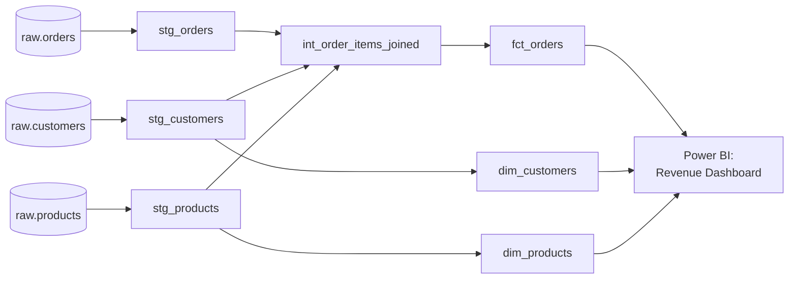

# dbt E-Commerce Analytics Mart

**Status:** 🔜 Planned (next build after [Retail Sales ETL Pipeline](../../data-engineering/retail-sales-etl-pipeline/))

## Business Problem

An e-commerce company's raw `orders`, `customers`, and `products` tables live in a warehouse, but every team computes "revenue" and "active customer" slightly differently in their own spreadsheets. Leadership has stopped trusting the numbers because no two dashboards agree.

## Objective

Build a dbt project that transforms raw warehouse tables into a single, tested, documented set of analytics marts — so "monthly revenue" is defined exactly once and every dashboard inherits the same number.

## Architecture

## Planned Tech Stack

- **Transformation:** dbt-core
- **Warehouse:** PostgreSQL locally / Snowflake or BigQuery target for cloud parity
- **Testing:** dbt schema tests (`unique`, `not_null`, `relationships`) + custom singular tests
- **Documentation:** `dbt docs generate` published as static site
- **CI:** GitHub Actions running `dbt build` + tests on every PR
- **BI:** Power BI connected to the `marts` schema only (never raw tables)

## Planned Deliverables

- [ ] `models/staging/` — 1:1 cleaned views of raw sources
- [ ] `models/intermediate/` — joined, business-logic-light models
- [ ] `models/marts/` — `fct_orders`, `dim_customers`, `dim_products`
- [ ] `schema.yml` test coverage on every model
- [ ] ER diagram of the mart layer
- [ ] Power BI dashboard: revenue trend, top products, customer cohorts
- [ ] GitHub Actions CI workflow (`dbt build`, `dbt test`)

## Key Design Decisions (to document once built)

- Why staging models are 1:1 with sources (no business logic at that layer)
- Why `fct_orders` is at the order-line grain, not the order grain
- How slowly changing customer attributes are handled

---
Back to [Analytics Engineering](../README.md) · [main portfolio](../../README.md).
