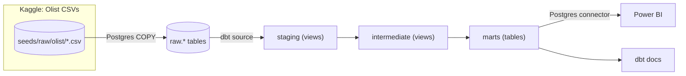

# dbt E-Commerce Analytics Mart

dbt project turning the real [Olist Brazilian E-Commerce dataset](https://www.kaggle.com/datasets/olistbr/brazilian-ecommerce) (Kaggle, ~120MB, ~100k orders) into a single, tested source of truth for revenue, customers, and product performance. No synthetic or generated data anywhere.

**Source code:** https://github.com/suryalionael/dbt-ecommerce-analytics-mart

## Project Status

| Area | Status |
| --- | --- |
| staging / intermediate / marts model layers | Done |
| Generic + custom dbt tests (108 passing) | Done |
| Docker Compose stack (Postgres + pgAdmin) | Done |
| GitHub Actions CI (`dbt build` + `dbt docs generate` on every push/PR) | Done |
| dbt docs site (models, columns, tests, sources, exposures, lineage DAG) | Done |
| Power BI dashboard | 🔜 Planned — exposure already declared in `models/marts/_exposures.yml` |

**Definition of done:** a fresh clone with the real CSVs in place can run `docker compose up -d postgres`, then `dbt deps && dbt build && dbt docs generate`, and reach 0 errors (one documented, non-blocking `WARN`). CI proves this on every push against a disposable Postgres service container loading the same real data.

## Business Problem

An e-commerce company's raw `orders`, `customers`, and `products` tables live in a warehouse, but every team computes "revenue" and "active customer" slightly differently in their own spreadsheets. Leadership has stopped trusting the numbers because no two dashboards agree.

## Objective

Build a dbt project that transforms raw warehouse tables into a single, tested, documented set of analytics marts — so "monthly revenue" is defined exactly once and every dashboard inherits the same number.

## Quick Start

```bash
git clone https://github.com/suryalionael/dbt-ecommerce-analytics-mart
cd dbt-ecommerce-analytics-mart
docker compose up -d postgres pgadmin   # auto-loads the real CSVs on first boot
docker compose up -d dbt
docker compose exec dbt bash -c "dbt deps && dbt build"
docker compose exec dbt dbt docs generate && docker compose exec dbt dbt docs serve --port 8081
```

Full setup (including the local-Postgres fallback path) in the [project README](https://github.com/suryalionael/dbt-ecommerce-analytics-mart#local-setup).

## Architecture


```mermaid
flowchart LR
    subgraph Source["Kaggle: Olist CSVs"]
        CSV[("seeds/raw/olist/*.csv")]
    end
    CSV -->|"Postgres COPY"| RAW[("raw.* tables")]
    RAW -->|dbt source| STG["staging (views)"]
    STG --> INT["intermediate (views)"]
    INT --> MARTS["marts (tables)"]
    MARTS -->|Postgres connector| BI["Power BI"]
    MARTS --> DOCS["dbt docs"]
```

Raw CSVs are bulk-loaded with Postgres `COPY`, not `dbt seed` — `dbt seed` inserts row-by-row and doesn't scale to Olist's 100k+ row tables (an early version of this project auto-seeded them by accident and a `dbt build` went from ~2 seconds to ~200+ seconds).

## Data Model

- **`fct_orders`** — order-line grain fact (one row per unit purchased). `revenue = price + freight_value`, defined once and never redefined downstream.
- **`dim_products`** — product dimension with sales rollups (`avg_price`, `total_units_sold`).
- **`dim_customers`** — customer lifetime value/recency, built on Olist's `customer_unique_id` rather than the raw `customer_id` (which is re-minted per order — aggregating on it directly would make every customer show exactly 1 lifetime order).
- **`fct_revenue_monthly`** — the official monthly revenue metric layer (`total_revenue`, `total_orders`, `active_customers`).

## Dataset

- Source: Kaggle, **Olist Brazilian E-Commerce Public Dataset** (real, anonymized orders from a Brazilian marketplace, 2016–2018)
- URL: https://www.kaggle.com/datasets/olistbr/brazilian-ecommerce
- Scale: ~99,441 orders, ~112,650 order line items, ~95,420 unique customers
- Sanity-checked results: ~92,500 one-time customers vs. ~2,700 repeat customers, monthly revenue ~R$1M in mid-2018, top categories (`bed_bath_table`, `garden_tools`, `furniture_decor`) — all consistent with known public analyses of this dataset.

## Folder Structure

```text
.
├── .github/workflows/ci.yml   # GitHub Actions CI
├── docker/init/                # Postgres bootstrap: raw schema + COPY load
├── docs/overview.md             # dbt doc blocks: KPI/grain definitions
├── macros/                      # order_line_revenue() + no_negative_revenue test
├── models/
│   ├── staging/                 # 1:1 cleaned mapping of raw sources
│   ├── intermediate/            # joins/enrichment, no KPI calculations
│   └── marts/{core,customer,finance}/
├── seeds/raw/olist/              # real Olist CSVs (git-tracked)
├── tests/                       # singular data-quality tests
├── docker-compose.yml
└── README.md
```

## Testing & Data Quality

- Generic: `not_null`, `unique`, `relationships`, `dbt_utils.accepted_range`, `dbt_utils.unique_combination_of_columns`.
- Custom generic: `no_negative_revenue`, applied across every price/freight/revenue/spend column.
- Custom singular: `order_revenue_consistency` (error — regression guard against join fan-out) and `customer_spend_accuracy` (warn — real payment-vs-item reconciliation gap, ~0.3% of customers, intentionally surfaced rather than suppressed since Olist's `payment_value` legitimately includes installment interest/vouchers that don't map 1:1 onto item price + freight).

## Design Decisions

- **Order-line grain for `fct_orders`**, not order-level — no information loss, and every downstream model aggregates up from one single grain instead of each reinventing its own rollup.
- **`customer_unique_id`, not raw `customer_id`, for `dim_customers`** — see Data Model above. This is the kind of source-data nuance that wouldn't fail any generic dbt test (unique/not_null would all still pass) but silently makes a KPI meaningless if missed.
- **Raw CSVs via Postgres `COPY`, not `dbt seed`** — a real lesson from building this: `dbt seed` is for small static reference data, not 100k+ row extracts.
- **`table`, not `incremental`, materialization for marts** — Olist is a static historical extract with no new orders landing daily; a full rebuild costs ~2 seconds.
- **Pin `dbt-core`/`dbt-postgres` to `<1.9`** — newer releases can resolve to the "Fusion" engine preview, which doesn't support the Postgres adapter yet. Hit this twice (locally and independently in CI) before pinning it explicitly in both places.

## Future Improvements

- Build and publish the Power BI dashboard (revenue trend, customer LTV distribution, top product categories) against the exposure already declared in `models/marts/_exposures.yml`.
- Add screenshots of the dbt docs site and the dashboard once built.

---
Back to [Analytics Engineering](../README.md) · [main portfolio](../../README.md).
