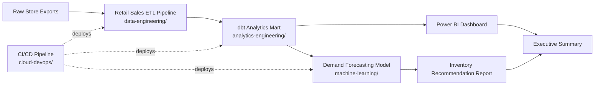

# End-to-End Retail Data Platform (Capstone)

**Status:** 🔜 Planned — built last, intentionally, once the component projects below exist.

## Business Problem

A retail business has sales data, but no single platform connecting "what happened" (BI) to "what's likely to happen" (ML) to "why" (explainability) — analysts, the inventory team, and leadership each work from disconnected exports.

## Objective

Combine the individual projects in this portfolio into one cohesive platform: raw sales data flows through a pipeline, into a tested warehouse model, feeds both a BI dashboard and a demand-forecasting model, and surfaces a single set of business recommendations a stakeholder could act on.

## Architecture

## Why This Is Built Last

Each component above (`retail-sales-etl-pipeline`, `dbt-ecommerce-analytics-mart`, `retail-demand-forecasting`, `cicd-data-pipeline-deployment`) is a standalone project elsewhere in this repo. This capstone reuses them rather than rebuilding from scratch — proving the components were designed to compose, not just demo in isolation. It's the project most worth showing in a final-round interview.

## Planned Deliverables

- [ ] Single `docker-compose.yml` spinning up the full stack (warehouse, Airflow, dbt, model API)
- [ ] End-to-end data lineage diagram (raw file → executive recommendation)
- [ ] One combined "business impact" write-up: estimated cost of stockouts/overstock avoided
- [ ] Recorded demo walkthrough (GIF or short video) for the README

---
Back to [Case Studies](../README.md) · [main portfolio](../../README.md).
