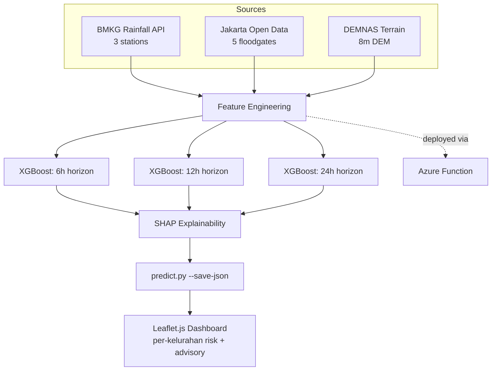

# Flood Risk Prediction — Dicoding Datathon 2026

**Status:** ✅ Built — live repo: [github.com/suryalionael/Datathon-Dicoding2026-FloodRisk](https://github.com/suryalionael/Datathon-Dicoding2026-FloodRisk)

## Business Problem

Jakarta floods every rainy season, and the Ciliwung corridor (South/East Jakarta) is among the hardest-hit areas. Emergency responders (BPBD) need **neighborhood-level** flood probability forecasts 6–24 hours ahead — district-level alerts are too coarse and too late for effective evacuation planning.

## What Was Built — "FloodCast Jakarta"

A multi-horizon XGBoost system predicting flood risk for 15 pilot neighborhoods (kelurahan) along the Ciliwung corridor, combining BMKG rainfall data, floodgate telemetry, and DEM terrain data into calibrated probability forecasts at 6h/12h/24h horizons — classified into 4 operational alert levels (Aman/Waspada/Siaga/Awas) with SHAP-based explainability in Bahasa Indonesia, surfaced through an interactive offline-capable map dashboard.

## Architecture

## Tech Stack

- **Modeling:** XGBoost (multi-horizon ensemble), Optuna hyperparameter tuning, class-imbalance handling (flood events are 2–8% of hours)
- **Explainability:** SHAP, localized to Bahasa Indonesia for end-user advisories
- **Deployment:** Azure Functions (serverless inference), static web app dashboard
- **Frontend:** Leaflet.js interactive map, dark-themed, fully offline-capable
- **Language:** Python (modular `flood_risk/` package — ingestion, features, training, evaluation, explainability as separate layers)

## Key Engineering Decisions

- **Threshold calibration:** F1-maximizing threshold sweep constrained to a minimum 70% recall — missing a real flood is far costlier than a false alarm, so recall was prioritized explicitly rather than optimizing a blended metric blindly.
- **Class imbalance:** handled via `scale_pos_weight` plus balanced sample weights, not naive resampling, to preserve the true event-rate signal.
- **Modular package design:** ingestion, feature engineering, training, evaluation, and explainability are separate, independently testable layers — not one notebook.

## Full Documentation

See the [live repository](https://github.com/suryalionael/Datathon-Dicoding2026-FloodRisk) for the full README, EDA notebook, training/prediction scripts, and dashboard demo instructions.

---
Back to [Case Studies](../README.md) · [main portfolio](../../README.md).
