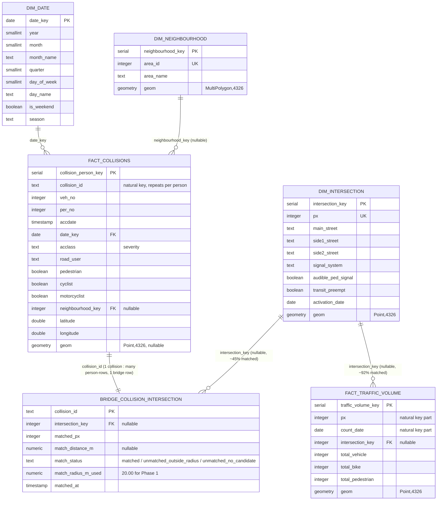

# Entity-Relationship Diagram

Toronto Mobility Intelligence — `analytics` schema. See [`DATA_MODEL.md`](DATA_MODEL.md) for
full column-level detail and the empirical reasoning behind this shape.



## Plain-text fallback

```
 dim_date                dim_neighbourhood
    |  1                        |  1
    |                           |  (nullable)
    * many                      * many
 fact_collisions  ------------------------------+
 (person grain, PK collision_person_key)        |
    | collision_id (many person-rows : 1 event)  |
    * 1                                          |
 bridge_collision_intersection                   |
 (PK collision_id, nullable intersection_key)    |
    | intersection_key (nullable, ~45% matched)   |
    * many                                        |
 dim_intersection  <---------------- many ---- fact_traffic_volume
 (PK intersection_key, UK px)         intersection_key (nullable, ~92% matched)
                                       PK traffic_volume_key, UK (px, count_date)
```

## Reading the "nullable" relationships

Two joins in this model are intentionally nullable, and both nullability rates are empirically
derived, not assumed:

- **`bridge_collision_intersection.intersection_key`** — null for ~55.3% of collisions. This is
  expected: most KSI collisions happen at unsignalized intersections, stop-sign intersections,
  or midblock, none of which exist in the Traffic Signals dataset. See `DATA_MODEL.md` §2.
- **`fact_traffic_volume.intersection_key`** — null for ~7.8% of TMC intersection-keyed rows,
  where the TMC `px` value doesn't resolve to a signal in the Traffic Signals dataset (likely
  beacons, pedestrian crossovers, or unsignalized intersections that still get a TMC count).
  See `DATA_MODEL.md` §2.5.

Both are modeled as `LEFT JOIN`-safe nullable foreign keys rather than forced/lossy matches.
