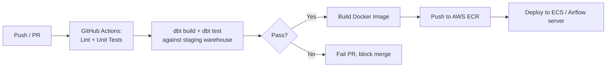

# CI/CD for Data Pipeline Deployment

**Status:** 🔜 Planned

## Business Problem

A data team's Airflow DAGs and dbt models are deployed by manually SSH-ing into a server and pulling the latest code — slow, undocumented, and one typo away from breaking production.

## Objective

Build a GitHub Actions CI/CD workflow that lints, tests, and deploys a dbt + Airflow data pipeline automatically on every merge to `main`, with a rollback path if deployment fails.

## Architecture

## Planned Tech Stack

- **CI/CD:** GitHub Actions
- **Containerization:** Docker, Amazon ECR
- **Deployment target:** AWS ECS (or a self-managed EC2 Airflow box, documented trade-off)
- **IaC:** Terraform for ECR repo + ECS service provisioning

## Planned Deliverables

- [ ] `.github/workflows/ci.yml` — lint (`ruff`/`sqlfluff`), unit tests, `dbt build/test`
- [ ] `.github/workflows/deploy.yml` — build/push image, deploy on merge to `main`
- [ ] Terraform scripts for the minimal AWS infra needed
- [ ] Documented rollback procedure

---
Back to [Cloud & DevOps](../README.md) · [main portfolio](../../README.md).
