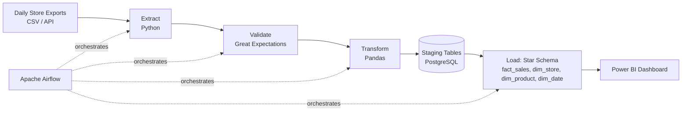

# Retail Sales ETL Pipeline

**Status:** 🔜 Planned (next build — see [roadmap](../../README.md#portfolio-roadmap-beginner--internship-ready))

## Business Problem

A multi-store retail chain receives daily sales exports (CSV/API) from each store's POS system in inconsistent formats. Finance and merchandising teams need a single, trusted daily view of sales by store, product, and category to make inventory and pricing decisions — but right now that means manually reconciling spreadsheets.

## Objective

Build an automated, idempotent ETL pipeline that ingests raw daily sales files, validates and cleans them, transforms them into a dimensional model, and loads them into a warehouse — ready for BI consumption — with zero manual intervention after deployment.

## Architecture



## Planned Tech Stack

- **Language:** Python (Pandas, SQLAlchemy)
- **Orchestration:** Apache Airflow (daily DAG, retries, alerting on failure)
- **Data Quality:** Great Expectations (schema checks, null checks, referential integrity)
- **Warehouse:** PostgreSQL (star schema: `fact_sales`, `dim_store`, `dim_product`, `dim_date`)
- **Containerization:** Docker Compose (Airflow + Postgres, fully local, reproducible)
- **Visualization:** Power BI connected directly to the warehouse

## Planned Deliverables

- [ ] Airflow DAG with extract → validate → transform → load tasks
- [ ] Data quality test suite (Great Expectations checkpoints)
- [ ] Star schema DDL scripts + ER diagram
- [ ] `docker-compose.yml` for one-command local setup
- [ ] Sample Power BI dashboard (`.pbix`) showing sales by store/category/time
- [ ] README updated with screenshots and a 60-second demo GIF once built

## How This Will Be Run (once built)

```bash
docker compose up -d
# Airflow UI at localhost:8080 — trigger the `retail_sales_etl` DAG
```

---
Back to [Data Engineering](../README.md) · [main portfolio](../../README.md).
