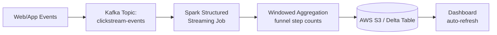

# Streaming Clickstream Pipeline

**Status:** 🔜 Planned (Q1–Q2 — see [roadmap](../../README.md#portfolio-roadmap-beginner--internship-ready))

## Business Problem

An e-commerce platform wants to detect drop-offs in the checkout funnel in near real time (within minutes, not next-day batch reports) so marketing and product teams can react to broken flows or flash-sale traffic spikes as they happen.

## Objective

Build a streaming ingestion pipeline that captures clickstream events (page views, add-to-cart, checkout steps), processes them in near real time, and lands aggregated funnel metrics somewhere a dashboard can poll every few seconds.

## Architecture

## Planned Tech Stack

- **Streaming broker:** Apache Kafka
- **Processing:** Spark Structured Streaming (Python/PySpark)
- **Storage:** AWS S3 (Parquet/Delta format), partitioned by event date
- **Language:** Python
- **Local dev:** Docker Compose (Kafka + Spark + MinIO as S3-compatible local stand-in)

## Planned Deliverables

- [ ] Synthetic clickstream event generator (Python, configurable event rate)
- [ ] Kafka producer/consumer setup with schema (Avro/JSON Schema)
- [ ] Spark Structured Streaming job with tumbling-window funnel aggregation
- [ ] Checkpointing and exactly-once / at-least-once delivery notes
- [ ] Architecture write-up explaining trade-offs vs. the batch pipeline in [`retail-sales-etl-pipeline/`](../retail-sales-etl-pipeline/)

---
Back to [Data Engineering](../README.md) · [main portfolio](../../README.md).
