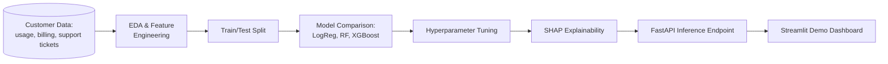

# Customer Churn Prediction — Telecom

**Status:** 🔜 Planned

## Business Problem

A telecom provider loses a meaningful share of its subscriber base every month, and the retention team has a limited budget for proactive outreach (discounts, calls). They need to know **which customers are most likely to churn in the next billing cycle** so retention spend targets the highest-risk, highest-value customers instead of being spread evenly (and wastefully) across everyone.

## Objective

Build a churn classification model that outputs a calibrated churn probability per customer, identify the top drivers of churn with explainability tooling, and expose predictions through a simple API/dashboard the retention team could actually query.

## Architecture

## Planned Tech Stack

- **Language:** Python
- **Modeling:** scikit-learn (Logistic Regression, Random Forest baseline), XGBoost (final model)
- **Tuning:** `GridSearchCV` / `Optuna`
- **Explainability:** SHAP (global feature importance + per-customer waterfall plots)
- **Deployment:** FastAPI (`/predict` endpoint), Streamlit (interactive demo for non-technical reviewers)
- **Containerization:** Docker

## Planned Deliverables

- [ ] EDA notebook with class-imbalance analysis
- [ ] Feature engineering pipeline (tenure buckets, usage trend deltas, support-ticket frequency)
- [ ] Model comparison table (precision/recall/F1/ROC-AUC, not just accuracy — churn is imbalanced)
- [ ] SHAP summary + force plots for top churn drivers
- [ ] FastAPI service with `/predict` and `/health` endpoints
- [ ] Streamlit dashboard: upload a customer ID, see churn probability + top 3 reasons
- [ ] Business write-up translating model output into a recommended retention-budget allocation

## Evaluation Approach

Accuracy is intentionally **not** the headline metric — churn datasets are imbalanced and a "predict no one churns" model can still hit 85%+ accuracy. Precision/recall trade-off will be tuned against an assumed retention-offer cost vs. customer lifetime value, and reported explicitly.

---
Back to [Machine Learning](../README.md) · [main portfolio](../../README.md).
