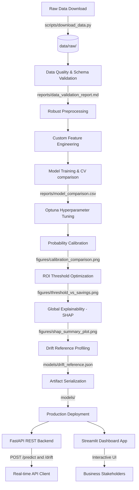

# Telecom Customer Churn Prediction & Retention System

[](https://github.com/suryalionael/Customer-Churn-Prediction/actions/workflows/ci.yml)
[](https://fastapi.tiangolo.com/)
[](https://streamlit.io/)
[]()

An end-to-end production-grade Machine Learning system designed to predict customer churn probability, explain individual risk drivers using SHAP, recommend optimal retention interventions, and simulate business ROI.

**Portfolio location:** `machine-learning/customer-churn-prediction-telecom/`  
**Standalone source repository:** [suryalionael/Customer-Churn-Prediction](https://github.com/suryalionael/Customer-Churn-Prediction)

---

## 1. Project Overview & Business Problem

Subscribers are the lifeblood of telecommunication providers. Acquiring a new customer is **5x to 25x more expensive** than retaining an existing one. Rather than distributing untargeted, blanket retention discounts, this system identifies customers who are highly likely to churn in the next billing cycle. 

By targeting only high-risk and high-value customers with a tailored proactive outreach (e.g., automated email campaigns, direct agent phone calls, or billing discounts), the retention team can maximize customer lifetime value (LTV) and optimize their promotional budget.

---

## 2. System Architecture

Below is the conceptual architecture of the pipeline, from data download to inference:



---

## 3. Key Model & Financial Results

Our model comparison evaluated Logistic Regression, Random Forest, LightGBM, and XGBoost. An optimized and calibrated XGBoost model was selected:

### Model Performance Metrics (Holdout Test Set)
* **ROC-AUC:** `0.8467`
* **PR-AUC:** `0.6572` (critical metric for handling class imbalance)
* **Balanced Accuracy:** `0.7410`
* **Optimal Decision Threshold:** `0.50` (tuned to maximize savings)

### Expected Campaign Business Value
* **Baseline Churn Revenue Loss (Do Nothing):** `$250,000+`
* **Simulated Net Financial Savings:** **`$20,480.66`** (based on holdout test set)
* **Campaign Return on Investment (ROI):** **`86.49%`**
* **Incentive Cannibalization Cost:** Accounted for and minimized through threshold tuning.

---

## 4. Repository Structure

```
telecom-churn-prediction/
├── .github/
│   └── workflows/
│       └── ci.yml             # GitHub Actions CI pipeline
├── app/
│   ├── schemas/
│   │   └── customer.py        # Pydantic schema schemas
│   ├── main.py                # FastAPI endpoints
├── config/
│   └── config.yaml            # Central configuration file
├── dashboard/
│   └── streamlit_app.py       # Streamlit Portal Dashboard
├── data/
│   ├── raw/                   # Unmodified raw CSV data
│   └── processed/             # Cleaned datasets
├── docs/                      # Extensive guides
│   ├── architecture.md
│   ├── ml_pipeline.md
│   ├── deployment.md
│   ├── feature_engineering.md
│   └── explainability.md
├── figures/                   # Explanatory generated charts
├── models/                    # Pickled estimators and metadata JSONs
├── notebooks/                 # Executable Jupyter Notebooks
├── reports/                   # Performance and validation reports
├── scripts/
│   ├── download_data.py       # Raw dataset downloader
│   └── generate_notebooks.py  # Notebook generator script
├── tests/                     # Pytest testing suite
├── Dockerfile                 # Multi-service Docker config
├── docker-compose.yml         # Container coordinator
├── requirements.txt           # Main dependencies
└── README.md                  # This file
```

---

## 5. Quick Start & Installation

### Local Setup
1. **Clone the Repository:**
   ```bash
   git clone <repo-url>
   cd telecom-churn-prediction
   ```

2. **Setup Virtual Environment & Install Dependencies:**
   ```bash
   python3 -m venv venv
   source venv/bin/activate
   pip install -r requirements.txt
   ```

3. **Download Data & Execute Training Pipeline:**
   ```bash
   python scripts/download_data.py
   python -m src.train
   ```

4. **Launch the FastAPI Server:**
   ```bash
   uvicorn app.main:app --host 0.0.0.0 --port 8000
   ```

5. **Launch the Streamlit Dashboard:**
   ```bash
   streamlit run dashboard/streamlit_app.py
   ```

### Docker Compose Deployment
To launch the API (port 8000) and Dashboard (port 8501) inside isolated containers:
```bash
docker-compose up --build
```

---

## 6. API Documentation

Swagger UI is available at `http://localhost:8000/docs`.

### Predict Endpoint (`POST /predict`)
```bash
curl -X 'POST' \
  'http://localhost:8000/predict' \
  -H 'accept: application/json' \
  -H 'Content-Type: application/json' \
  -d '{
  "customerID": "7590-VHVEG",
  "gender": "Female",
  "SeniorCitizen": 0,
  "Partner": "Yes",
  "Dependents": "No",
  "tenure": 1,
  "PhoneService": "No",
  "MultipleLines": "No phone service",
  "InternetService": "DSL",
  "OnlineSecurity": "No",
  "OnlineBackup": "Yes",
  "DeviceProtection": "No",
  "TechSupport": "No",
  "StreamingTV": "No",
  "StreamingMovies": "No",
  "Contract": "Month-to-month",
  "PaperlessBilling": "Yes",
  "PaymentMethod": "Electronic check",
  "MonthlyCharges": 29.85,
  "TotalCharges": 29.85
}'
```

### Sample Response
```json
{
  "customerID": "7590-VHVEG",
  "churn_probability": 0.5841,
  "prediction": 1,
  "confidence": 0.585,
  "risk_category": "High",
  "recommended_action": "Retention Call: Offer free Online Security + Tech Support bundle for 3 months.",
  "top_risk_drivers": [
    {
      "feature": "Contract_Month-to-month",
      "shap_value": 0.354,
      "raw_value": 1.0,
      "business_explanation": "Being on a Month-to-Month contract is a major risk factor, making it easy for the customer to cancel."
    }
  ],
  "top_protective_factors": [
    {
      "feature": "OnlineBackup_Yes",
      "shap_value": -0.092,
      "raw_value": 1.0,
      "business_explanation": "Subscribing to active cloud backups increases stickiness."
    }
  ]
}
```

### Drift Monitoring Endpoint (`POST /drift`)
Submit a recent customer batch to compare production feature distributions against the training reference profile saved at `models/drift_reference.json`.

```bash
curl -X 'POST' \
  'http://localhost:8000/drift' \
  -H 'Content-Type: application/json' \
  -d '[{ ... customer payload ... }]'
```

The response includes per-feature PSI scores, warning/drift feature lists, and an overall `drift_detected` flag.

---

## 7. Lessons Learned & Future Improvements

1. **Probability Calibration is Vital:** Raw XGBoost models overestimate the certainty of high-risk customers. Calibration via Platt scaling (sigmoid mapping) reduced our Brier Score and ensured that probabilities map to actual financial outcomes.
2. **Imbalance Handling:** Applying custom class weights (`scale_pos_weight` in XGBoost) was crucial to prevent the model from underperforming on the minority churn class.
3. **What-If simulators build business trust:** Business stakeholders care about absolute profit margins rather than abstract F1-scores. Demonstrating actual campaign net savings using optimal thresholds bridged the gap between ML engineering and corporate decision-making.

**Future Enhancements:**
* Integrate MLflow for model registry tracking.
* Extend drift monitoring with Evidently AI dashboards and scheduled alerts.
* Export the calibrated pipeline to ONNX format to optimize inference latencies under high concurrency.
