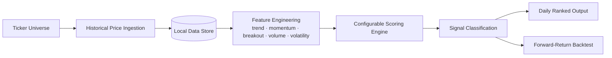

# IDX Stock Signal Scanner

**Status:** 🚧 Actively developed — source is in a **private repository** (this folder is a high-level overview only; scoring logic and configuration are intentionally not published).

## Business Problem

Retail investors screening the Indonesia Stock Exchange (IDX) for technical setups typically do it manually, ticker by ticker — slow, inconsistent, and impossible to backtest. There's no systematic, repeatable way to scan a large ticker universe daily and rank candidates by setup quality.

## What It Does

A modular Python pipeline that pulls historical daily price data for a configurable universe of IDX tickers, computes a set of technical-analysis features (trend, momentum, breakout, volume, volatility), scores each ticker through a configurable rule engine, and classifies results into ranked signal tiers — with a forward-return backtesting module to evaluate signal quality over time.

## High-Level Architecture

## Tech Stack

- **Language:** Python
- **Data:** `yfinance` for historical OHLCV, with a swappable data-provider interface
- **Storage:** Parquet + SQLite, local-first (no cloud dependency at this stage)
- **Configuration:** YAML-driven scoring rules — thresholds and weights are tunable without code changes
- **Evaluation:** Forward-return backtesting (multiple holding-period windows) with hit-rate and drawdown metrics

## Why It's Here (and Why It's Light on Detail)

This is an active, evolving project I'm treating as a potential product, not just a learning exercise — so the scoring methodology and configuration stay private for now. What's shown here demonstrates the engineering pattern: clean separation between data ingestion, feature computation, and decision logic, with the rule engine fully swappable for a model-based scorer as the project matures.

---
Back to [Machine Learning](../README.md) · [main portfolio](../../README.md).
