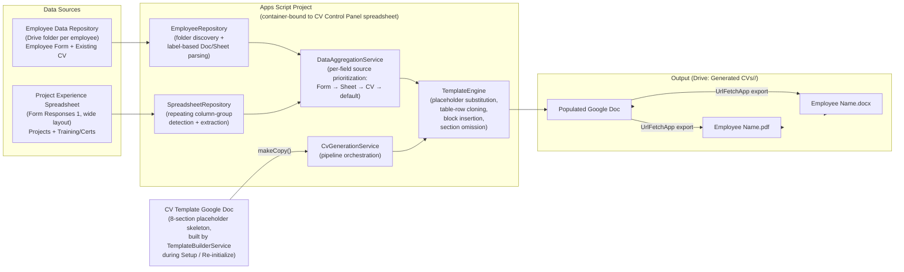

# MSI CV Generator — Architecture

## Data Flow

## Layer Responsibilities

| Layer | Files | Responsibility |
|---|---|---|
| **Config** | `src/config/Config.gs` | Single source of truth for all IDs, sheet names, placeholder tokens, section headings, filename patterns. `getConfig()` merges static constants with runtime IDs from Script Properties. |
| **Controllers** | `src/controllers/` | Thin wiring layer. `MenuController.gs` installs the Google Sheets custom menu. `CvController.gs` implements the batch-continue generation loop and summary UI. `SetupController.gs` runs the idempotent initialization routine. |
| **Services** | `src/services/` | Business logic. `TemplateBuilderService.gs` creates the placeholder template Doc programmatically. `DataAggregationService.gs` applies the per-field source-prioritization table. `CvGenerationService.gs` orchestrates the single-employee pipeline. |
| **Repositories** | `src/repositories/` | Data access. `SpreadsheetRepository.gs` reads the project spreadsheet with column-group detection. `EmployeeRepository.gs` discovers Drive folders and parses Employee Forms/CVs. `ControlPanelRepository.gs` manages the Control Panel, Logs, and Summary sheets. |
| **Templates** | `src/templates/` | Document manipulation. `TemplateEngine.gs` populates a template copy via placeholder substitution, table-row cloning, paragraph-block insertion, and section omission. |
| **Utils** | `src/utils/` | Leaf utilities with no dependencies on other layers. `Logger.gs`, `ErrorHandler.gs`, `DateUtils.gs`, `TextUtils.gs`. |

## Section-Omission Model

If a placeholder's source data is empty, the **entire section** (heading + divider + content) is removed from the generated CV — no empty headings or blank tables are left visible.

| Section | Placeholder | Omit condition |
|---|---|---|
| PROFESSIONAL SUMMARY | `{{SUMMARY}}` | `summary` is blank |
| TECHNICAL SKILLS | `{{TECHNICAL_SKILLS}}` | `technicalSkills` array is empty |
| WORK EXPERIENCE | `{{WORK_EXPERIENCE}}` | `workExperience` array is empty |
| EDUCATION | `{{EDUCATION}}` | `education` array is empty |
| TRAINING & PROFESSIONAL DEVELOPMENT | `{{TRAINING}}` | `training` array is empty |
| KEY PROJECTS | `{{PROJECTS}}` | `projects` array is empty |
| ADDITIONAL INFORMATION | `{{ADDITIONAL_INFORMATION}}` | both `additionalInformation` and `languages` are blank |

## Template Engine Algorithms

### Table-Row Cloning (Technical Skills / Education / Training)
1. Find the table in the document body that contains the anchor placeholder text.
2. `templateRow.copy()` — creates a detached clone.
3. `table.insertTableRow(index, clone)` — inserts before the template row.
4. `clone.replaceText(placeholder, value)` — scoped to the cloned row only.
5. Repeat for each data item. Remove the original template row after all clones are inserted.
6. If the data array is empty, trigger section omission instead.

### Paragraph-Block Insertion (Work Experience / Key Projects)
1. Find the sentinel paragraph (`{{WORK_ENTRY}}` or `{{PROJECT_ENTRY}}`), note its body index, remove it.
2. For each entry, insert formatted paragraphs at the noted index (incrementing the index after each insert):
   - **Bold** position/title paragraph
   - Plain context line (company | period | location)
   - Native list items (`body.insertListItem()` with `GlyphType.BULLET`) for bullets — never literal "•" characters

## Known Apps Script API Limitations

| Golden reference feature | Limitation | Workaround implemented |
|---|---|---|
| Per-paragraph bottom border (section headings) | `DocumentApp` does not expose paragraph border attributes | 1×1 table with only a bottom border line inserted after each heading paragraph |
| A4 page size guarantee | `DocumentApp.create()` uses the Workspace locale default (may not be A4 in all regions) | Documented in README — HR verifies once post-Setup via File > Page Setup; setting persists on the template and all copies |
| MSI logo in page header | `DocumentApp` supports inserting images in the body but header/footer image insertion from Apps Script has limitations | Documented as a one-time manual post-Setup customization: open the template Doc and insert the logo into the document header; persists across all copies |
| `.docx` native Word numbering | Apps Script generates native Doc list items which export to valid OOXML `<w:numPr>` lists | No workaround needed — `GlyphType.BULLET` list items produce the correct OOXML structure |
